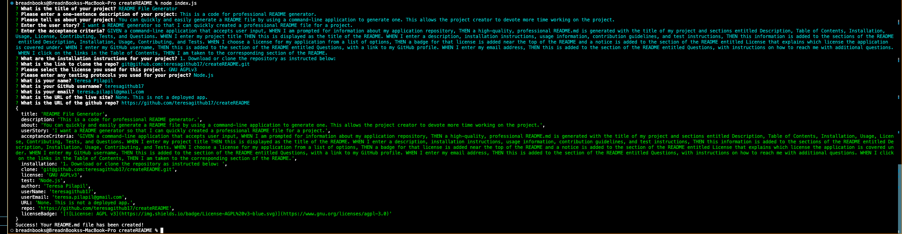

# README File Generator

## Description
This is a code for professional README generator.

---
## Table of Contents
1. [Usage](#about)
     * [User Story](#userStory)
     * [Acceptance criteria](#acceptanceCriteria)
     * [Visuals](#visuals)
     * [Build](#build)
2. [Installation](#installation)
3. [License](#license)
4. [Contributing](#contributing)
5. [Tests](#tests)
6. [Authors and acknowledgment](#authors%20and%20acknowledgment)
---
## About
#### You can quickly and easily generate a README file by using a command-line application to generate one. This allows the project creator to devote more time working on the project.
---
## User Story
#### I want a README generator so that I can quickly created a professional README file for a project.
---
## Acceptance Criteria
#### GIVEN a command-line application that accepts user input, WHEN I am prompted for information about my application repository, THEN a high-quality, professional README.md is generated with the title of my project and sections entitled Description, Table of Contents, Installation, Usage, License, Contributing, Tests, and Questions. WHEN I enter my project title THEN this is displayed as the title of the README. WHEN I enter a description, installation instructions, usage information, contribution guidelines, and test instructions, THEN this information is added to the sections of the README entitled Description, Installation, Usage, Contributing, and Tests. WHEN I choose a license for my application from a list of options, THEN a badge for that license is added near the top of the README and a notice is added to the section of the README entitled License that explains which license the application is covered under. WHEN I enter my GitHub username, THEN this is added to the section of the README entitled Questions, with a link to my GitHub profile. WHEN I enter my email address, THEN this is added to the section of the README entitled Questions, with instructions on how to reach me with additional questions. WHEN I click on the links in the Table of Contents, THEN I am taken to the corresponding section of the README.

---
## Screenshot

---
## Installation:
Since this is not a deployed app, you need to download or clone the repository as instructed below: 
To clone the repo:

    git clone git@github.com:teresagithub17/createREADME.git

---
## License
ISC

* For more information on license types, please reference this [website](https: //choosealicense.com/](https://choosealicense.com/).
---
## Contributing

To contribute to this application, create a pull request.
Here are the steps needed for doing that:
- Fork the repo
- Create a feature branch (git checkout -b NAME-HERE)
- Commit your new feature (git commit -m 'Add some feature')
- Push your branch (git push)
- Create a new Pull Request
Following a code review, your feature will be merged.
---
## Tests
* Node.js
---
## Authors and Acknowledgments
* Teresa Pilapil
---
## Contact Information
If you have further questions please reach out to the following contact information:
* GitHub Username: teresagithub17
* GitHub Email: teresa.pilapil@gmail.com

